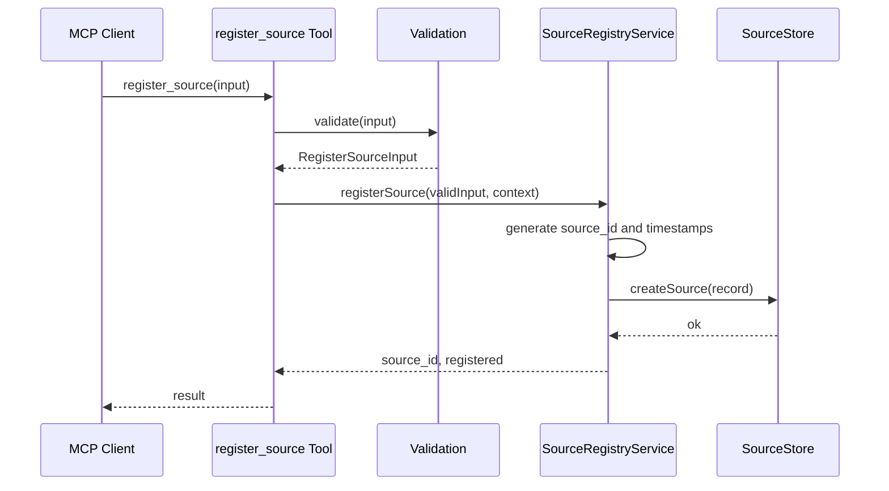

# IMPL: Source Registry

## 0. 対応するSPEC
- SPEC: `SPEC-SOURCEREGISTRY-001-001`
- Feature: `SOURCEREGISTRY-001`
- Tool: `kodama.register_source`

## 1. 配置図
### 1.1 新規ファイル
| path | purpose |
|---|---|
| `src/types/source-registry.ts` | Source registry domain types |
| `src/services/source-registry-validation.ts` | Deterministic input validation |
| `src/services/source-registry-service.ts` | Registration orchestration |
| `src/adapters/source-store.ts` | Storage adapter interface and in-memory implementation for tests |
| `src/mcp/register-source-tool.ts` | MCP tool registration and handler binding |
| `tests/source-registry.test.ts` | Behavior tests for acceptance criteria |

### 1.2 変更ファイル
| path | change |
|---|---|
| `src/index.ts` | Create MCP server entry point and register Source Registry tool |
| `tests/index.test.ts` | Keep server name test and add import-safe coverage if needed |

### 1.3 削除ファイル
削除対象はない。

## 2. 型定義
### 2.1 データ型
```ts
type SourceType = "local_files" | "github";
type StorageMode = "copy" | "index" | "reference" | "ephemeral";

interface RegisterSourceInput {
  type: SourceType;
  name: string;
  config: Record<string, unknown>;
  storage_mode: StorageMode;
}

interface RegisterSourceOutput {
  source_id: string;
  status: "registered";
}

interface SourceRecord {
  id: string;
  type: SourceType;
  name: string;
  config: Record<string, unknown>;
  storageMode: StorageMode;
  createdAt: string;
  updatedAt: string;
}
```

### 2.2 関数シグネチャ
```ts
function validateRegisterSourceInput(input: unknown): RegisterSourceInput;

class SourceRegistryService {
  registerSource(input: unknown, context: RegistrationContext): Promise<RegisterSourceOutput>;
}

interface SourceStore {
  createSource(record: SourceRecord): Promise<void>;
}
```

### 2.3 MCP 契約
MCP handler receives unknown JSON-like input, validates it through `validateRegisterSourceInput`, delegates persistence to `SourceRegistryService`, and maps domain errors to structured MCP errors with SPEC §5.3 codes.

## 3. シーケンス
### 3.1 正常系フロー


### 3.2 トランザクション境界
`SourceStore.createSource` is the persistence boundary. Durable stores must create the Source record atomically. If persistence fails, the service returns `SOURCE_REGISTRY_UNAVAILABLE` and no partial Source record is considered successful.

### 3.3 並行性
Concurrent registrations are allowed. Each request generates a distinct source id before persistence. Stores must enforce unique id insertion or retry id generation on collision.

## 4. エラー処理
### 4.1 例外分類
| exception | condition | propagation | user message | code |
|---|---|---|---|---|
| InvalidSourceTypeError | type is not valid or unsupported | MCP structured error | Source type is not supported | `INVALID_SOURCE_TYPE` or `UNSUPPORTED_SOURCE_TYPE` |
| InvalidSourceNameError | name is not a valid string | MCP structured error | Source name is invalid | `INVALID_SOURCE_NAME` |
| InvalidStorageModeError | storage mode is not valid | MCP structured error | Storage mode is invalid | `INVALID_STORAGE_MODE` |
| InvalidSourceConfigError | config shape is invalid | MCP structured error | Source config is invalid | `INVALID_SOURCE_CONFIG` |
| SourceRegistryUnavailableError | store create fails | MCP structured error | Source registry is unavailable | `SOURCE_REGISTRY_UNAVAILABLE` |

### 4.2 リトライ方針
Validation errors are not retried. Source id collision may be retried up to three times inside the service. Store availability errors are returned to the caller without automatic retry.

### 4.3 フォールバック
Tests use in-memory `SourceStore`. Runtime fallback from durable storage to memory is not allowed because it would lose source records silently.

## 5. 既存コードとの取り合い
### 5.1 依存する既存モジュール
- `src/index.ts` currently exports `serverName`.
- `@modelcontextprotocol/sdk` provides MCP server primitives.

### 5.2 拡張する既存関数
`main()` in `src/index.ts` will be replaced with MCP server startup logic after Gate A/B/C pass.

### 5.3 非互換変更の有無
No public code API exists yet beyond `serverName`, so no incompatible runtime change is expected.

## 6. ログ出力
### 6.1 出力ポイント
| point | fields | destination |
|---|---|---|
| validation failure | error code, source type when parseable, actor id when available | audit sink interface |
| registration success | source id, source type, storage mode, actor id when available | audit sink interface |
| store failure | error code, source type, storage mode | audit sink interface |

### 6.2 監視連携
Initial implementation exposes audit sink and structured error codes. Metrics export is deferred to monitoring feature work.

## 7. 設定値
No environment variable is required for in-memory tests. Durable storage adapter configuration is outside this feature and must be introduced through a separate SSOT update.

## 8. セキュリティ
- Do not persist secrets in source config.
- Do not shell out with config values.
- Do not fetch remote provider content during registration.
- Preserve actor identity in service context when provided.

## 9. トレース
| spec | implementation | verify |
|---|---|---|
| FR-SOURCEREGISTRY-001 | `SourceRegistryService.registerSource` | AC-SOURCEREGISTRY-001-001, AC-SOURCEREGISTRY-001-002 |
| FR-SOURCEREGISTRY-002 | `validateRegisterSourceInput` | AC-SOURCEREGISTRY-001-003 |
| FR-SOURCEREGISTRY-003 | `validateRegisterSourceInput` | validation tests |
| FR-SOURCEREGISTRY-004 | `validateRegisterSourceInput` | AC-SOURCEREGISTRY-001-004 |
| FR-SOURCEREGISTRY-005 | id generation in service | source id tests |
| FR-SOURCEREGISTRY-006 | audit sink calls | audit event tests |

## §Evidence
### 実 file 引用
- `src/index.ts` currently contains only `serverName` and unimplemented `main`.
- `docs/spec/SOURCEREGISTRY-001.md` defines the target behavior for this implementation.

### Web 検索 / 公式 doc URL
- No external web source was used for this implementation plan.
